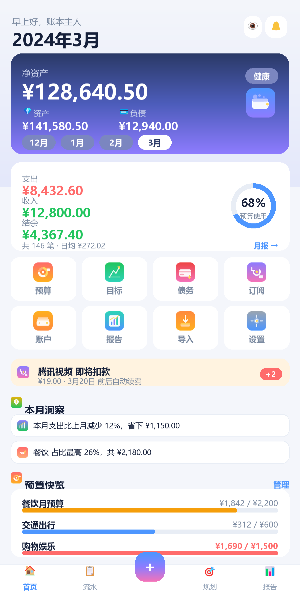
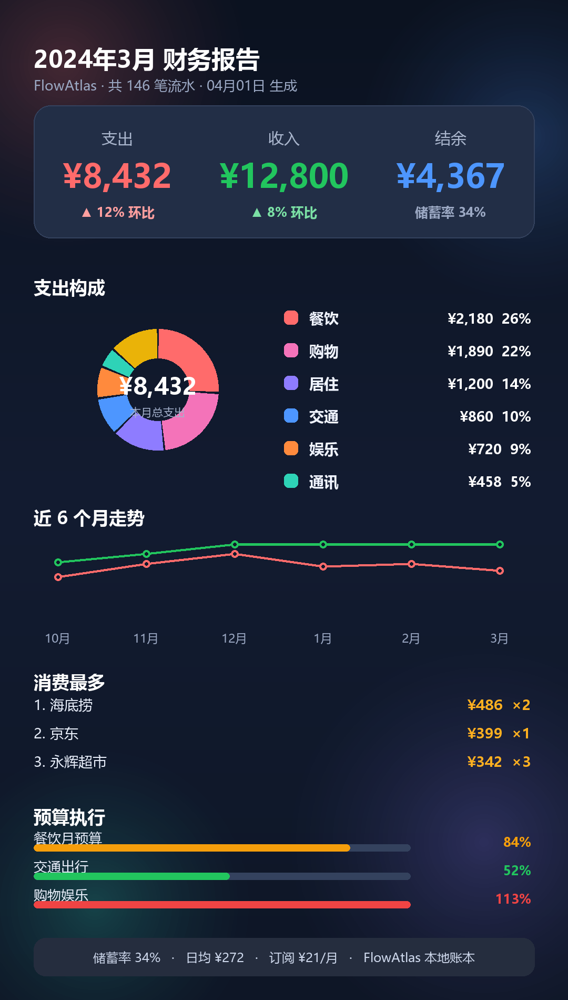
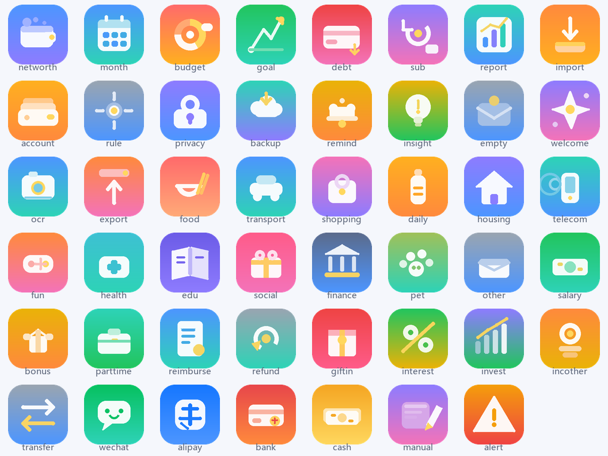

# FlowAtlas · 流水图鉴

> 为 **华为 nova9** 等安卓手机设计的**本地优先**个人财务 PWA：导入微信 / 支付宝 / 银行账单 → 自动识别分类 → 预算 / 目标 / 债务 / 订阅 → 每月自动生成可分享的图文报告。

无账号、无联网、无广告、无内购。所有账单解析、分类、统计都在手机浏览器里完成，数据只存在你自己的手机上。

| 首页 | 月度报告长图 |
| --- | --- |
|  |  |

---

## 一、快速开始

| 方式 | 适合场景 | 是否生成桌面图标 | 是否需要电脑 |
| --- | --- | --- | --- |
| **A. 单文件离线版** | 立刻体验，零配置 | 否 | 否 |
| **B. 局域网 / 静态托管 + 添加到桌面** | 有电脑或能上网 | 是（快捷方式） | 需要 |
| **C. 云端构建 APK** ⭐ | 想真正装成 App | 是（真·安装包） | 只需浏览器 |
| **D. 本机构建 APK** | 已装 Android Studio | 是 | 需要 |

完整图文步骤见 **[android-app/README-安装指引.md](android-app/README-安装指引.md)**。

### 方式 A：单文件离线版（最简单）
直接用浏览器打开 [dist/FlowAtlas-离线版.html](dist/FlowAtlas-离线版.html) —— 这是一个把 CSS/JS/插图全部内联进来的单文件（约 330 KB），拷进手机、用华为浏览器打开即可，不依赖服务器。

### 方式 B：局域网部署（可添加到桌面）
在电脑上（与本机同一个 Wi-Fi）：

```powershell
cd finance-app
python -m http.server 8899        # 或 npm i -g serve && serve -l 8899
```

手机浏览器访问 `http://电脑IP:8899` → 菜单 →「添加到桌面 / 安装应用」。
安装后像原生 App 一样全屏运行，**断网也能用**（Service Worker 已缓存全部资源）。

### 方式 C：任意静态托管
整个目录丢到 GitHub Pages / Gitee Pages / 对象存储即可，无需任何后端。

---

## 二、怎么导出账单

| 来源 | 路径 |
| --- | --- |
| **微信支付** | 我 → 服务 → 钱包 → 账单 → 右上角「常见问题」→ 下载账单 → **用于个人对账** → 选时间范围 → 邮箱下载后解压得到 CSV |
| **支付宝** | 我的 → 账单 → 右上角「…」→ 开具交易流水证明 → **用于个人对账** → 选时间范围 → 邮箱下载 CSV |
| **银行卡** | 手机银行 App → 交易明细 → 导出（Excel / CSV） |

支持格式：`.csv` `.txt` `.xlsx`（UTF-8 与 **GBK 自动识别**）。微信/支付宝导出的说明行、空行、汇总行都会被自动跳过。

---

## 三、功能一览

**① 账户与数据源**：微信 / 支付宝 / 银行卡 / 现金 / 其他，多账户独立结算余额，可校准对账。

**② 导入与解析引擎**
- 自动识别来源（微信 / 支付宝 / 银行 / 通用表格）
- 自动跳过账单说明行、**自动定位表头**（在多行噪音中找出真正的表头行）
- 13 类字段自动映射（时间、对方、商品、收支、金额、支付方式、状态、交易单号、商户单号、分类、备注、币种、余额）
- GBK / UTF-8 编码自动识别，`.xlsx` 通过浏览器原生解压直读（无需第三方库）
- 金额符号、千分位、括号负数、`¥` 前缀清洗；订单状态过滤（关闭/失败自动剔除）
- **交易单号唯一键 + 模糊指纹（同账户/同分钟/同金额/同商户）双重去重**

**③ 自动识别与分类**（三层递进）
1. **记忆层**：你改过的商户 → 永久记住（含子分类）
2. **规则层**：40+ 组规则、400+ 关键词、商户别名归并（KFC→肯德基、美团平台商户→美团）；先用「商户名+交易类型」高精度匹配，再退到全文
3. **模型层**：本地中文 bigram 朴素贝叶斯，越用越懂你；置信度 < 55% 时标记「待确认」

另外自动识别：**内部转账**（关键词 + 跨账户等额配对）、**退款关联**、**周期性订阅**（间隔方差 + 金额稳定性）、**异常交易**（MAD 离群、同商户同额重复扣款、凌晨大额）。

**④ 自动整理**：账户归集、去重、**交易拆分**、批量改分类/账户/标签、搜索与多条件筛选、余额校准。

**⑤ 财务规划**：分类预算 / 月度总预算（进度、超支预警、**日均可用额度**）、储蓄目标（进度环、每月需存测算）、债务管理（本金/剩余/年化/月供/**还清期数测算**/记录还款）、订阅管理（月均与年化成本、下次扣款倒计时、**自动检测建议**）。

**⑥ 月度报告**：收支总览与环比、支出构成环形图、近 6 月趋势、**每日消费热力图**、Top 商户排行、异常交易、预算执行、资产负债、储蓄率、自动文字洞察；一键导出**分享长图 PNG** / 打印 PDF / CSV / 文字摘要。

**⑦ 提醒**：导入提醒、订阅扣款、账单日临近、预算超支与花太快、月报生成。

**⑧ 设置与隐私**：本地加密（PBKDF2 15 万次 + AES-256-GCM）、JSON 备份与恢复（合并 / 覆盖）、CSV 导出、隐藏金额、深浅主题、数据彻底删除。

---

## 四、目录结构

```
finance-app/
├── index.html              应用外壳（13 个脚本按序加载，无构建步骤）
├── manifest.webmanifest    PWA 清单
├── sw.js                   Service Worker（离线缓存）
├── css/app.css             全部样式（含深浅主题、丰富配色）
├── js/
│   ├── util.js             工具：金额/日期/统计/DOM 无关的纯函数 + 安卓原生桥
│   ├── illustrations.js    47 张内置插图（data URI，离线可用）
│   ├── store.js            数据模型、分类体系、持久化、加密、账务计算
│   ├── categorize.js       规则库 + 商户别名 + 贝叶斯 + 订阅/转账/异常识别
│   ├── parsers.js          CSV / XLSX / OCR / 手工 解析引擎
│   ├── charts.js           原生 Canvas 图表（环形/柱状/折线/排行/热力/进度环）
│   ├── report.js           月度报告建模、洞察生成、分享长图
│   ├── ui.js               hyperscript、路由、弹层、表单生成器、图标
│   ├── views-main.js       首页仪表盘、流水明细、交易详情
│   ├── views-plan.js       预算 / 目标 / 债务 / 订阅 / 账户
│   ├── views-import.js     导入流程、OCR 补录、导入历史
│   ├── views-report.js     报告页与多种导出
│   ├── views-more.js       设置、隐私、规则库、备份
│   └── app.js              启动、主题、锁屏、首次引导、示例数据
├── samples/                微信 / 支付宝 / 银行 / GBK 编码 样例账单
├── assets/                 47 张插图源文件（SVG + PNG，可自行替换）
├── icons/                  PWA 图标
├── docs/                   设计预览图 / 插图总览
└── tools/                  自测脚本、插图与预览生成脚本

android-app/                ★ 安卓原生外壳（把这个文件夹一起上传即可云构建 APK）
├── app/src/main/java/…     MainActivity：WebView + 资产加载器 + 文件选择 + 原生保存
├── app/src/main/res/       图标、主题、网络安全配置
├── .github/workflows/      云端一键出 APK 的工作流
├── sync-web.js             把网页端同步进 assets/www
└── README-安装指引.md       三条安装路线 + 常见问题

dist/FlowAtlas-离线版.html   单文件离线版（双击即用）
```

---

## 五、测试

```bash
node tools/selftest.js        # 解析 / 分类 / 统计：58 项断言
node tools/uitest.js          # 界面渲染烟测：15 个页面 + 13 项交互
node tools/build_offline.js   # 重新生成 dist/FlowAtlas-离线版.html
```

测试脚本都不需要浏览器（自带极简 DOM 垫片），改完代码随手跑一遍即可。

---

## 六、界面与插图

界面刻意做成「**以图为主**」：每个模块、每个消费分类、每个区块标题都有专属插图。

- **47 张矢量插图**：18 个功能模块（净资产 / 月报 / 预算 / 目标 / 债务 / 订阅 / 报告 / 导入 / 账户 / 规则 / 隐私 / 备份 / 提醒 / 洞察 / 空状态 / 欢迎 / OCR / 导出）、23 个收支分类、6 个账户来源与警示。
- 插图由 `tools/make_illustrations.py` **参数化生成**，同一份图元规格同时产出 `assets/illust-*.svg`（源文件，可自行改色改形）、`assets/png/*.png`（位图，直接取用）和 `js/illustrations.js`（内联 data URI，离线/单文件版用）。
- 修改配色或造型只需编辑脚本里的图元列表，重跑一次即可全部更新。
- **首页封面图**：在「我的 → 首页封面图」可从相册选一张照片作为净资产卡背景，会压缩到 1080px 后只存本机；一键可恢复默认插画。



---

## 七、数据与隐私

- 数据存于浏览器 `localStorage`，**从不上传**；
- 开启密码后，写入前用 PBKDF2(150000) 派生密钥 + AES-256-GCM 整体加密；
- 卸载浏览器 / 清理数据会清空账本 —— 请定期在「我的 → 备份」导出 JSON；
- 换手机时用「合并导入」或「覆盖恢复」即可迁移全部账户、预算、目标、债务、订阅与学习记录。

## 八、已知限制

- **截图 OCR**：通道与文本解析已实现，但未内置识别模型。把 Tesseract.js 离线包（含 `chi_sim`）放到 `js/vendor/` 并在 `index.html` 引入后自动启用；未启用时仍可用截图快速补录（自动预填金额/商户/日期）。
- **系统级推送**：目前是应用内提醒中心（`android-app` 壳已预留原生 Toast 通道，可扩展为通知）。
- `.xls`（旧版二进制 Excel）不支持，请另存为 `.xlsx` 或 CSV。
- 账单文件名与内容会保留在本机元数据里（用于导入历史），可在设置中清空。
- APK 为 **debug 签名**，仅供自己与朋友安装；上架应用市场需自行配置正式签名证书与隐私声明。
